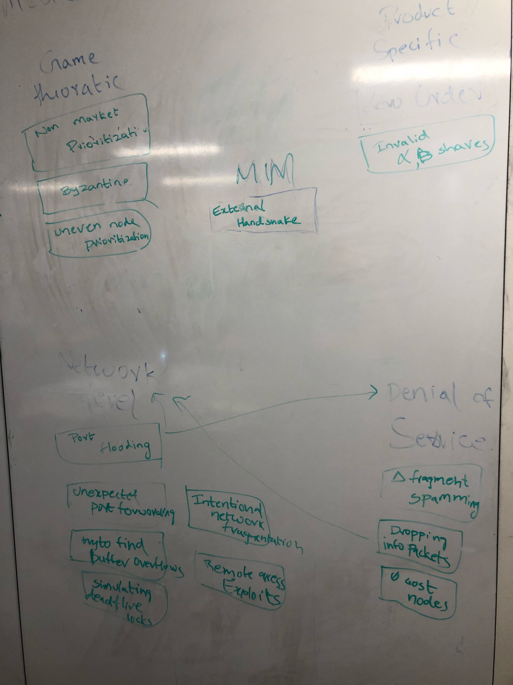
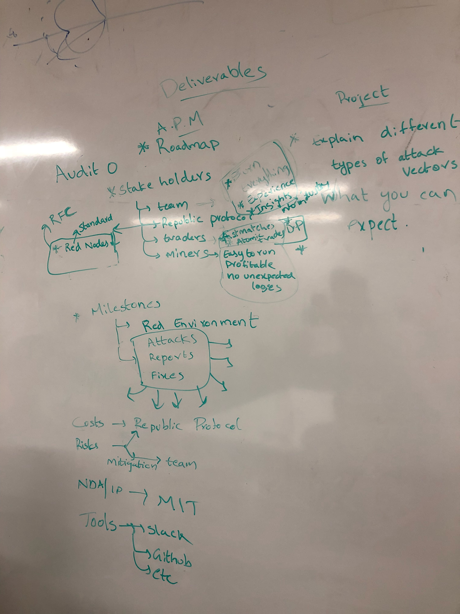

# 28 February 2018

In this meeting, we discussed details about our project with John and categorised the different node into smaller groups.

We developed categories of attacks on the whiteboard to help us draw connections between the diffent attacks. This will help us to improve and combine the different attacks, and come up with better attack ideas.

We started planning the project audit, ensuring that we address each of the different criteria.

